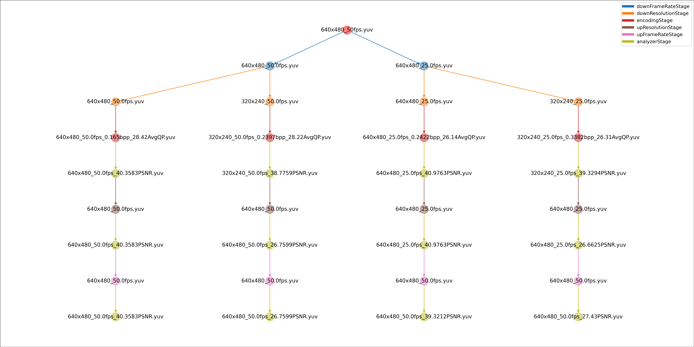

# Video Coding Test Framework

To test some video coding method, We design this framework. The result is as below:
 
while the config file is as follows:
```yaml
# 要处理的视频父路径
input: 'data/640x480_50fps.yuv'
outputFolder: 'results/'
# 视频降帧参数
downFrameRateStage:
  BinaryFileProcess:
    downRate: [1, 0.5]

# 视频绛分辨率参数
downResolutionStage: 
  FFmpeg:
    downRate: [1, 0.5]

encodingStage:
  HEVC:
    Q: [20]
    keyInterval: 10

analyzerStage0:
  PSNR:
    useDataType: 'YUV'

upResolutionStage:
  USR: 'NoParams'

analyzerStage1:
  PSNR:
    useDataType: 'YUV'

upFrameRateStage:
  DAIN: 'NoParams'

analyzerStage2:
  PSNR:
    useDataType: 'YUV'

visualizationResultStage:
  Flow: 'NoParams'

```
## install
1. `git clone --recursive https://github.com/likangGit/VideoPhotoRepair.git`
2. run `install.sh`
3. download model_weights and put it into 'modules/thirdparty/VideophotoRepair/'：[百度云盘](https://pan.baidu.com/s/1GX13NFvkSmGtk93JO0y3Mw) 提取码:mw7y  
    ```shell
    VideoPhotoRepair/
    ├── DAIN
    ├── data
    ├── DeepRemaster
    ├── model_weights
    └── USRNet
    ```
4. If you want to use HLVC in decoding, download pre-trained model of HLVC, unzip and put the folder "HLVC_model" into 'modules/thirdparty/HLVC/':
   [Download link](https://drive.google.com/drive/folders/1JWRIp7RgZZEulrUfQAlbAnAkA6MAKRbE?usp=sharing)
    ```shell
    HLVC/
    ├── CA_Entropy_Model-master
    ├── HLVC_model
    ├── ………………
    ```
   And download BGP method for I frame compression: [Download link](https://bellard.org/bpg/)
    
   @Paper of HLVC method: [[Paper]](https://arxiv.org/abs/2003.01966).


5. If you want to use RLVC in decoding, download pre-trained model of RLVC, unzip and put the folder "model" into 'modules/thirdparty/RLVC/':
   [Download link](https://drive.google.com/drive/folders/1JWRIp7RgZZEulrUfQAlbAnAkA6MAKRbE?usp=sharing)
    ```shell
    RLVC/
    ├── model
    ├── RLVC.py
    ├── ………………
    ```
   And download BGP method for I frame compression: [Download link](https://bellard.org/bpg/)
    
   @Paper of RLVC method: [[Paper]](https://arxiv.org/pdf/2006.13560.pdf).


## Run
1. modify "config.yaml"  
   **note:** the order of stage means the order of execution. If you want to change order of execution, you can just exchange the order of stage in 'config.yaml'.  
   **note:** the method name below the stage name means what method you want to execute in this stage. You can use one or several methods in one stage. If you don not want to execute the method, you can just comment it.
2. `conda activate VCtest`
3. run command `python main.py`
   
## Develop
The framework is designed to add modules in the form of plug-ins. You can add your own plugin by follwing the setps below:
1. create a python file in path "modules/"
2. Write your own code by imitating the code in 'downFrameRate.py' or 'hevc.py' and add it to the new python file
3. add config information in config.yaml according to the code you wrote.